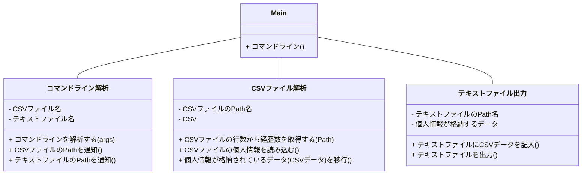

# 詳細設計書  

## ・仕様説明
### エンジニア情報が格納されているCSVファイルを読み込み、指定形式でテキストファイルに出力する。  

## ・仕様要件
 1. コマンドラインからパラメータとして入力ファイル名、出力ファイル名を取得
 1. コマンドラインからは、「-」 で始まるオプションの設定が可能
 1. CSVファイルを入力として、項目を編集しテキストファイルへ出力を行う  
   (コマンドライン解析、CSVファイル解析、テキストファイル出力はクラスとして作成)
 2. エラー処理

## ・要件説明
**1.入力・出力ファイル形式**
-  読み込むCSVファイルの内容(1ファイルに1名のスキル情報が格納されている)
   1. 1行目：ヘッダー情報
   1. 2行目：名前
   1. 3行目：生年月日
   1. 4行目：住所
   1. 5行目：番号、開始日付、終了日付、案件名、案件概要、使用OS、使用言語  
   (6行目以降は、5行目と同様)

  (※1.ヘッダー情報を除いた2.~5.を**個人情報**とする。)

～ファイルサンプル～
```userdata.CSV
userdata  
汐見朔也  
1994年9月15日  
東京都千代田区霞が関2丁目1-2  
001,2020年1月1日,2020年9月30日,A案件,BBB,Linux,Java  
002,2020年10月1日,2021年3月31日,C案件,ddd,Windows,Java  
003,2021年4月1日,2021年7月31日,E案件,FFF,Linux,C言語  
004,2021年8月20日,2021年12月31日,G案件,HHHHH,Linux,Java  
005,2022年1月1日,2022年8月10日,I案件,JJ,Windows,C言語  
006,2022年9月1日,2022年11月30日,K案件,LLL,Linux,C言語  
007,2023年2月1日,2023年9月30日,M案件,NNNN,Linux,Java  
```

- 出力するテキストファイルの内容(１ページを30行として、1個のスキルデータがページをまたがらないように配置)
   1. 1行目：氏名、生年月日、住所
   1. 2行目：ーーーーーーーーーーーーーーーーーーーー(枠線)
   1. 3行目：番号
   1. 4行目：開始日付 ー 終了日付
   1. 5行目：（案件名）案件概要
   1. 6行目：使用OS,使用言語  
   (7行目以降は、2行目～6行目を繰り返す)  
   
(※1.氏名、生年月日、住所を除いた2.～6.を**経歴エリア**とする。)  

～ファイルサンプル～
```userdata.txt
汐見朔也、1994年9月15日、東京都千代田区霞が関2丁目1-2
ーーーーーーーーーーーーーーーーーーーー
001
2020年1月1日ー2020年9月30日
A案件：BBB
Linux,Java
ーーーーーーーーーーーーーーーーーーーー
002
2020年10月1日ー2021年3月31日
C案件：ddd
Windows,Java
ーーーーーーーーーーーーーーーーーーーー
003
2021年4月1日ー2021年7月31日
E案件：FFF
Linux,C言語
ーーーーーーーーーーーーーーーーーーーー
004
2021年8月20日ー2021年12月31日
G案件：HHHHH
Linux,Java
ーーーーーーーーーーーーーーーーーーーー
005
2022年1月1日ー2022年8月10日
I案件：JJ
Windows,C言語 


```
↑ここまでが1ページ(30行)  
（経歴エリアがページを跨がないようにするため、入力できない・しない行は空白とする）
  
↓ここから2ページ目  
（先頭行は経歴エリアから記載する）
```
ーーーーーーーーーーーーーーーーーーーー
006
2022年9月1日ー2022年11月30日
K案件：LLL
Linux,C言語
ーーーーーーーーーーーーーーーーーーーー
007
2023年2月1日ー2023年9月30日
M案件：NNNN
Linux,Java
```
---

**2.クラス詳細** 
<div style="text-align: center;">
(図1)クラス図の概要
</div>



1. **Mainクラス** 
    1. コマンドラインからパラメータ、オプションを読み込む。パラメータの1つ目が入力用ファイル、2つ目が出力用ファイルである。  
    CSVファイルとテキストファイルはそれぞれ1つのみ使用可能とする。(オプションは省略可能)  
    この際に入力ファイルと出力ファイルが指定されなければエラー処理をしてプログラムを終了する。
   1. `コマンドライン解析クラス`でコマンドラインの整合性の確認を行う。  

   2. `CSVファイル解析クラス`でCSVファイルの内容の確認を行う。  

   3. `テキストファイル出力クラス`でテキストファイルへの出力を行う。  

2. **コマンドライン解析クラス** *(クラス名:ReadCommandline)*   
    
      引数は**パラメータ**。
   1. CSV/テキストファイル名をPath型に変換する。
   2. 現在位置のPathを取得し、CSV/テキストファイルのPath型と合体させて1つのファイルPathにする。
   3. CSVファイルの存在をチェックする。存在しなかったらエラー処理をしてプログラムを終了する。
   4. テキストファイルの存在をチェックする。  
   ※本仕様では"出力時に新たにテキストファイルを作成する"となっているため、既存かどうかを確認する必要がある。  
   すでにその名前のテキストがある場合はエラー処理をしてプログラムを終了する。
   5. CSV/テキストファイルの**ファイルPath名**を返す準備をする。

3. **CSVファイル解析クラス** *(クラス名:ReadCSV)*  
      引数は**CSVファイルのファイルPath名**。
    1. CSVファイルを1行づつ読み込み、CSVファイルの総行数をカウントし、経歴数("総行数-4")を取得する。
    2. CSVファイルの内容を保管するデータベースを作成する。(便宜上、**CSVデータ**とする)  
    再度CSVファイルを読み込み、CSVデータの先頭に"技術者情報"として"名前"、"生年月日"、"住所"を読み込む。  
    3. CSVデータの"技術者情報"の下に"経歴情報"として"番号"、"開始日付"、"終了日付"、"案件名"、"案件概要"、"使用OS"、"使用言語"をそれぞれ読み込む。
    4. 3.を繰り返して記載されているすべての経歴情報を読み込む。(※CSVデータの構造は下図参照)  
    5. CSVデータの内容を確認する。このとき本来データがあるべき場所にデータがない場合はエラー処理をしてプログラムを終了する。
    6. 確認を完了し問題がなければ**CSVデータ**を返す準備をする。
  
<div style="text-align: left;">
(図2)CSVファイルの"技術者情報"と"経歴情報"を格納したCSVデータのイメージ図　(※記載内容=格納されている内容)
</div>

|(名前)|(生年月日)|(住所)| | | ||
|:---: | :---: | :---: | :---: | :---: | :---: | :---: |
|(番号_1)|(開始日時_1)|(終了日時_1)|(案件名_1)|(案件内容_1)|(使用OS_1) |(使用言語_1)|
|(番号_2)|(開始日時_2)|(終了日時_2)|(案件名_2)|(案件内容_2)|(使用OS_2) |(使用言語_2)|
|(番号_3)|(開始日時_3)|(終了日時_3)|(案件名_3)|(案件内容_3)|(使用OS_3) |(使用言語_3)|
<<以下省略>>

1. **テキストファイル出力クラス** *(クラス名:WriteTEXT)*  
  引数は**CSVデータ**と**テキストファイルのファイルPath名**。  
   1. テキストファイルの先頭行にCSVデータの技術者情報を書き込む。 
   2. テキストファイルの2行目に枠線を書き込んだ後、3行目にはCSVデータの"開始日時"と"終了日時"を、4行目には"案件"と""案件詳細"、5行目には"使用OS"と"使用言語"を書き込む。
   3. CSVデータから書き込むべき内容がなくなるまで2.を繰り返す。  
    ただし、1シートに記載できる内容が最大30行であるのと、経歴エリアがシートを跨がないようにするために、ここでは**記入可能行数**のカウントも行う。  
    (※記入可能行数の初期値は1ページ目のみ技術者情報が記載されているので**29**、2ページ目以降は*30*。  
    また経歴エリアは1エリアにつき**5行**確保するので、記入可能行数は2.が1回完了するごとにカウントが**5**減る。)   
    記入可能行数が**マイナス**になったら2.の処理を中断し、マイナスになる前の記入可能行数のカウント分、改行を挿入する。  
    その後記入可能行数のカウントを初期値(*30*)にリセットしてから書き込みを再開する。
	4. 完成したテキストファイルを出力する。